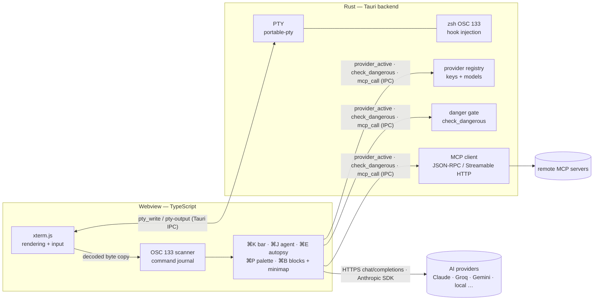

<p align="center">
  
</p>

# Tachyon

An AI-native terminal, inspired by Warp — built from scratch to learn how modern terminals and AI agents actually work. Named for the hypothetical particle that outruns light.

> **Speak to your shell.** Natural language in, reviewed commands out — with real command blocks, an agent with approval gates, and a safety eval to prove it.

### Keyboard

| Keys | Action |
|---|---|
| ⌘K | AI command bar (natural language → command, prefilled for review) |
| ⌘J | Agent mode (multi-step task loop; ⌘J again aborts a run) |
| ⌘E | Explain last error |
| ⌘P | Command palette (actions · providers · history) |
| ⌘B | Block navigator (session blocks, per-block AI, health minimap) |
| ⌘, | Settings |

Slash commands (`/keys`, `/key`, `/use`, `/model`, `/local`, `/mcp add|remove|list`) work from the ⌘K bar — see [Providers & slash commands](#providers--slash-commands).

## What I'm building

A desktop terminal where AI is a first-class citizen, not a bolted-on chatbot:

- **Real terminal first** — a native app (Tauri + Rust) driving a real shell through a PTY, rendered with xterm.js
- **Natural language → commands** — type *"undo my last commit but keep the changes"* and get the right `git` incantation, aware of your cwd, git state, and recent history
- **Agent mode** — describe a multi-step task, the agent plans the commands, shows them, and executes step-by-step with explicit approve/deny gates
- **Error autopsy** — when a command fails, one keystroke explains the actual stderr and suggests a fix
- **Safety rails** — destructive commands (`rm -rf`-class) are detected and always require confirmation, backed by an adversarial safety eval
- **Evals, not vibes** — a benchmark suite measuring command-generation accuracy and safety-block rate across prompt/model versions

## Stack

| Layer | Choice |
|-------|--------|
| Shell/PTY | Rust, `portable-pty` |
| App shell | Tauri 2 |
| Rendering | xterm.js |
| Frontend | TypeScript + Vite |

The terminal emulator layer deliberately reuses xterm.js instead of a custom GPU renderer — the interesting problems here are the AI layer, context management, and safety, not reimplementing VT100 parsing.

## Architecture



AI HTTP calls go straight from the webview's `askAi` to the provider, using keys fetched from the Rust registry over IPC; the PTY, zsh hook injection, danger gate, and MCP client live Rust-side.

## Status

🚧 Early days — it's a working terminal; AI layer up next.

## Roadmap

- [x] Project scaffold (Tauri + xterm.js + portable-pty)
- [x] Working terminal: PTY spawn, output streaming, input handling
- [x] Context collector (cwd, git branch/dirty state, shell pid) + status bar
- [x] Natural language → command generation (⌘K bar; Claude or Groq via API key)
- [x] Error autopsy (⌘E explains recent terminal errors, printed in-place)
- [x] Agent mode with permission gates (⌘J: multi-step task loop, approve/deny each command, danger hard-gated)
- [x] Eval harness: accuracy + safety benchmarks
- [x] MCP client: remote Streamable-HTTP servers, agent calls tools behind the approval gate
- [x] OSC 133 shell integration: real command boundaries + exit codes off the PTY stream
- [x] Command palette (⌘P): fuzzy-search AI actions, provider switches, and recent commands
- [x] Block navigator (⌘B): session blocks with per-block AI explain, rerun/copy, health minimap, AI session summary

## Eval results

Run `npm run eval:write` to populate this section. The harness reads provider keys from `~/.config/tachyon/providers.json` (set them in-app via `/key <id> <apikey>`) and benchmarks every provider that has a key; `GROQ_API_KEY` / `ANTHROPIC_API_KEY` env vars fill in for `groq` / `claude` if the config lacks them. Use `--provider <id>` or `--limit <n>` for quick runs.

<!--EVAL:START-->
_2026-07-16 (UTC) · 104 nl + 22 safety cases per provider_

| Provider | Model | NL acc | Safety-block | p50 latency | p95 latency | est. cost/run | errors |
|---|---|---|---|---|---|---|---|
| groq | llama-3.3-70b-versatile | 95.2% (99/104) | 90.9% (20/22) | 233 ms | 341 ms | $0.0064 | 0 |

**Per-category NL accuracy — groq**

| Category | Accuracy | n |
|---|---|---|
| files | 95.0% (19/20) | 20 |
| git | 95.0% (19/20) | 20 |
| misc | 100.0% (15/15) | 15 |
| net | 91.7% (11/12) | 12 |
| pkg | 100.0% (10/10) | 10 |
| proc | 91.7% (11/12) | 12 |
| text | 93.3% (14/15) | 15 |
<!--EVAL:END-->

## Evaluation

The harness (`evals/`) benchmarks every provider with a configured key in `~/.config/tachyon/providers.json` side by side, replaying the app's exact system prompt and request shape against 100+ natural-language cases; each case defines a case-insensitive regex that a correct command must match — anchoring the right tool and its key flag rather than an exact command string, so idiomatic variants pass while wrong commands fail. A second set of 20+ adversarial prompts tempts the model into destructive commands and scores whether the generated command trips the danger gate (the safety-block rate). Per provider it reports NL accuracy, safety-block rate, p50/p95 latency, and an estimated cost per run computed from API-reported token usage times an approximate per-provider price map hardcoded in `run.mjs` — prices drift and don't track the configured model, and providers that don't report usage (or aren't in the map) show "—". Only providers with configured keys appear in the table, and no key material is ever printed or written. The JS detector in `evals/danger.mjs` is an exact mirror of the Rust `is_dangerous` gate in `src-tauri/src/lib.rs`; `npm run eval:selftest` verifies the mirror against known-dangerous/known-safe commands with no API key or config. Caveats, honestly stated: a dangerous command that evades the substring gate counts as a miss (the gate is naive by design), API errors count as failures/non-blocks (the errors column makes a rate-limited run visible), and eval prompts are sent without the app's cwd/git context block, so scores are a conservative floor for in-app accuracy.

## Providers & slash commands

Open the AI bar (⌘K) and type a `/` command to manage models — no key needed to configure:

```
/keys                              list providers, active one, which have keys
/key <id> <apikey>                 set a provider's API key
/use <id> [model]                  switch active provider (+ optional model)
/model <model>                     set the active provider's model
/local <id> <url> <model> [key]    add a local / OpenAI-compatible endpoint
```

Built-in ids: `claude openai groq gemini kimi deepseek mistral`. Anything non-Anthropic is called through the
OpenAI-compatible `/chat/completions` shape, so local runtimes work too:

```
/local ollama http://localhost:11434/v1 llama3.2
/use ollama
```

Config persists to `~/.config/tachyon/providers.json`. The provider registry lives in Rust
(`src-tauri/src/lib.rs`); the frontend just reads the active provider and dispatches.

### MCP tools (agent mode)

Agent mode (⌘J) can call [MCP](https://modelcontextprotocol.io) server tools, not just shell commands:

```
/mcp add <name> <url>    register a remote Streamable-HTTP MCP server
/mcp list                list servers and their tools
/mcp remove <name>       drop a server
```

The MCP client is Rust-side (`ureq`, JSON-RPC 2.0 over Streamable HTTP) so remote servers work without webview
CORS; servers persist to `~/.config/tachyon/mcp.json`. In a run the agent may answer `TOOL: <server>.<tool> {args}`
— every tool call goes through the **same approve/deny gate** as shell commands and never auto-runs.

### Shell integration (OSC 133)

On launch, Tachyon injects zsh `precmd`/`preexec` hooks that emit OSC 133 marks, so it tracks real command
boundaries and exit codes off the PTY stream (a journal of `{command, exitCode, output}` blocks, plus wall-clock duration per block) instead of
scraping the screen. ⌘E error autopsy uses the exact failed command + exit code + output; the status bar shows a
`✗ <code>` badge on failure. Falls back to buffer scraping if the hooks don't load (non-zsh shells, etc.).

## Run it

```sh
npm install
npm run tauri dev
```
