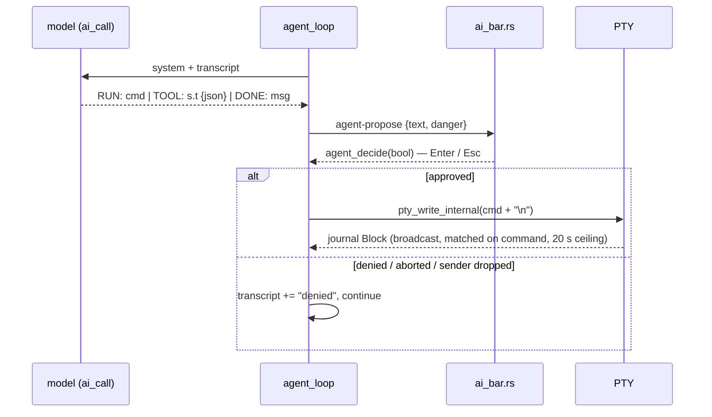

# Architecture

A map for contributors. The component diagram is in the [README](../README.md#architecture);
this file says which function does what. Safety design is in [danger-gate.md](danger-gate.md).

## Process model

Two Rust programs and an IPC bridge.

| Part | Crate | Runs as | Owns |
|---|---|---|---|
| Backend | `src-tauri/` (`tachyon_lib`) | native process (Tauri 2) | PTY, terminal engine, journal, providers, AI HTTP, agent loop, MCP client, config files |
| Frontend | `ui/` (`tachyon-ui`) | WASM in the system webview (Dioxus 0.7) | canvas painting, key encoding, overlays, the approval gate UI |

`ui/` is a standalone crate with its own `[workspace]`, not a member of `src-tauri`'s — hence
two `cargo test` runs and two CI caches. `ui/build-web.sh` runs `dx build` and copies the
output to `ui/dist`, the path `tauri.conf.json` bundles.

The bridge is `ui/src/bridge.rs`: `invoke(cmd, args)` wraps `window.__TAURI__.core.invoke`,
`listen(event, cb)` wraps `event.listen`. Commands are registered in `run()` at the bottom of
`src-tauri/src/lib.rs`; that `generate_handler!` list is the whole IPC surface. The frontend
holds no business logic and never sees an API key.

## Terminal data flow

```
shell ⇄ PTY ──bytes──▶ reader thread ─┬─▶ TerminalEngine::feed ─▶ take_damage ─▶ "grid-damage" ─▶ Term::apply ─▶ canvas
(portable-pty)         (pty_spawn)    └─▶ OscScanner::feed ─▶ Block ─▶ "journal-block" + broadcast
keydown ─▶ encode_key ─▶ invoke("pty_write") ─▶ pty_write_internal ─▶ PTY
```

- `pty_spawn` opens the PTY, starts `$SHELL`, injects the shell-integration script, and spawns
  one reader thread with a 64 KB buffer. Each chunk goes to two consumers.
- `engine.rs` — `TerminalEngine` wraps a `vt100::Parser` (grid, cursor, 5000 lines of
  scrollback). `take_damage` resolves every cell against the theme's `ColorTable`, diffs it
  against the last emitted snapshot, and returns only changed cells as `GridDamage`.
  `full_repaint` returns everything (mount, resize, theme change, scroll). While the user is
  scrolled into history the reader thread feeds the engine but does not emit.
- `ui/src/terminal.rs` — `Term::apply` paints the cells on a 2D canvas. `encode_key` turns a
  `KeyboardEvent` into the bytes a terminal sends, honouring `application_cursor` (DECCKM)
  from the last `GridDamage`. The key and paste listeners stand down while an overlay is open
  or an input is focused, so overlay typing never leaks to the shell.
- `term_write` feeds text into the engine for display only (⌘E output, agent narrative, slash
  results). It never touches the PTY.
- Grid dimensions from the webview are clamped by `clamp_dim`; they size an allocation.

## OSC 133 journal

At spawn, `shell_integration_script(shell)` picks `ZSH_INTEGRATION`, `BASH_INTEGRATION` or
`FISH_INTEGRATION` by the basename of `$SHELL` (`shell_path`, `shell_name`) and `pty_spawn`
writes it to the PTY. The hooks emit `OSC 133;A` (prompt), `C` (output starts) and `D;<exit>`
(command ended). zsh uses `precmd`/`preexec`; fish uses `fish_prompt`/`fish_preexec`/`fish_postexec`
events; bash has no preexec, so it chains onto `PROMPT_COMMAND` (preserving the user's) and
arms a one-shot `DEBUG` trap — read the comment above `BASH_INTEGRATION` before touching it. `OscScanner::feed` scans the raw byte stream for
those marks, carrying partial marks across chunk boundaries, and finalises a
`Block {command, exit_code, output, duration_ms}` on each `D`. The command text comes from
`set_typed_command` (the frontend's reconstruction of the typed line) when there is one,
otherwise from the echoed prompt line via `strip_ansi` + `strip_prompt_sigil`.

Blocks go three places: a ring of 50 in `JournalState.blocks` (`journal_blocks`,
`last_failed_block`), a `journal-block` event (⌘B navigator, status bar), and a
`tokio::sync::broadcast` channel the agent loop subscribes to for command results. Without
shell integration (any other shell) there is no journal; `pty_spawn` returns a warning string
and the frontend paints it once.

Platform differences are small and local: `cwd_of_pid` reads `/proc/<pid>/cwd` on Linux and
runs `lsof` (under `output_with_timeout`) elsewhere; `with_env` fills the `{env}` placeholder
in `AI_SYSTEM` / `AI_AGENT` with the detected shell and OS.

## Providers and the one HTTP path

`ProviderState` (`active` + `Vec<Provider>`) is loaded from `providers.json` on every call;
there is no in-memory cache to go stale. `mutate()` is the only writer and holds
`CONFIG_WRITE` across its read-modify-write. IPC returns `PublicProvider` /
`PublicProviderState`, which replace `key` with `has_key`.

`ai_call(system, user)` is the only function that talks to a model. `kind == "anthropic"`
posts to `/v1/messages`; everything else posts the OpenAI shape to
`{base_url}/chat/completions`. It uses one shared `reqwest` client with connect and request
timeouts. Callers: `ai_complete`, `nl_to_command` (⌘K; adds cwd/git from `shell_context_line`
and the last five blocks from `journal_context`, then `strip_fences` and `is_dangerous`),
`explain_last_error` / `explain_output` (⌘E, ⌘B), and `ai_call_abortable` for the agent.
Request and response shaping are pure functions (`build_*_body`, `parse_*_response`) so they
test without a network.

Slash commands (`/key`, `/use`, `/mcp …`) are parsed in `run_slash_inner` and return an ANSI
string the frontend paints with `term_write`.

## Agent loop

`agent_start` spawns `agent_loop` on the async runtime; the webview only renders proposals.



`parse_agent_reply` maps a reply to `AgentAction::{Run, Tool, Done, Invalid}`. At most 12
steps. `TOOL:` actions take the same gate and then call `mcp_call_inner` under
`spawn_blocking`. `AgentRunGuard` clears `running` and any parked proposal on every exit
path, including panic. Events out: `agent-status`, `agent-propose`, `agent-output`, `agent-done`.

## MCP client

Remote servers only, JSON-RPC 2.0 over Streamable HTTP with blocking `ureq`.
`mcp_rpc_session` does `initialize` → `notifications/initialized` → the request, a fresh
session per call, each POST under `MCP_TIMEOUT`. `parse_rpc_result` accepts JSON or a
single-response SSE body. `mcp_list_tools_inner` queries all servers concurrently and returns
tools plus per-server errors. There is no stdio transport and no server mode.

## Config files

`config_dir()` is `$XDG_CONFIG_HOME/tachyon`, else `$HOME/.config/tachyon`, else an error.

| File | Contents | Written by |
|---|---|---|
| `providers.json` | provider list, active id, **plaintext API keys** | `/key`, `/use`, `/model`, `/local` |
| `mcp.json` | MCP server names and URLs | `/mcp add`, `/mcp remove` |
| `keybindings.json` | `{action id: chord}` overrides; hand-edited | nothing — read-only to the app |

All reads go through `read_config`: a missing file is `Ok(None)`; a file that does not parse
is an `Err`, never a reset to defaults — a reset would be persisted over the user's keys by
the next write. All writes go through `write_config`: temp file in the same directory,
`chmod 0600`, then `rename`, so a reader sees the old file or the new one. Theme and font
settings live in the webview's `localStorage`, not here.

Keybindings: the backend's `keybindings` command is `read_config` on `keybindings.json` and
returns the raw `{id: chord}` map — it validates nothing. `ui/src/keymap.rs` owns both
vocabularies: the action table with per-platform defaults, the chord parser, the matcher, and
`Keymap::merge`, which ignores unknown ids and unparseable chords. A corrupt file is reported
in the terminal and the defaults are used.

## Frontend modules (`ui/src/`)

`app.rs` shared `AppState`, overlay routing, journal mirror · `terminal.rs` canvas, input,
selection, scroll · `ai_bar.rs` ⌘K / ⌘J bar and the approval gate · `blocks.rs` ⌘B navigator ·
`palette.rs` ⌘P · `vim.rs` vim navigation over the grid · `keymap.rs` bindings · `status.rs`
status bar · `settings.rs`, `theme.rs` appearance · `bridge.rs` IPC.

## Tests

| Where | What | Run |
|---|---|---|
| `src-tauri/src/lib.rs` `mod tests` | OSC scanner (split marks, ANSI stripping), provider registry and redaction, config round-trip and corruption, request/response shaping, agent reply parsing, danger gate, slash parsing | `cd src-tauri && cargo test` |
| `src-tauri/src/engine.rs` `mod tests` | damage diffing, colours, scroll, resize | same |
| `ui/src/*.rs` | key encoding, selection, vim motions, keymap parsing/matching — pure logic, runs on the host | `cd ui && cargo test` |
| `evals/` | model-facing behaviour; the keyless checks run in CI | see README → Evaluation |

Nothing tests the webview end to end; UI changes need a manual run (`npm run tauri dev`).
